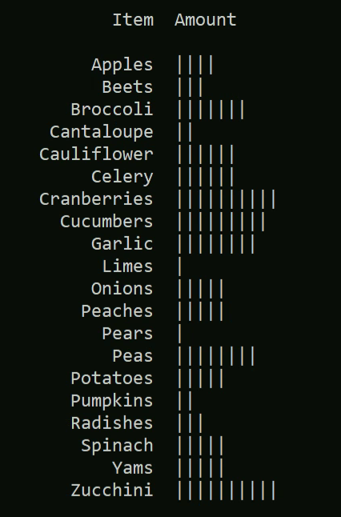

# Corner Grocer Item Tracker
Practice application in C++
Developed in Visual Studio
For CS-210-T3259 Programming Languages 23EW3 (SNHU)
7-3 Project Three
2/23/2023

## Documentation

### Project Summary
The (fictional) Corner Grocer needs a console app to analyze their text record of inventory items. These records list items purchased in chronological order from the time the store opens to the time it closes.

#### Problem Statement
The Corner Grocer would like to rearrange their produce section and needs an analysis of their purchased inventory to create the most effective layout for their customers.

### Requirements
The program I created satisfies the following functional requirements: 

#### User Menu
1: Prompt a user to input the item, or word, they wish to look for and return a numeric value for the frequency of the specific word.

2: Print the list with numbers that represent the frequency of all items purchased.

3: Print the frequency information for all the items in the form of a histogram. 

4: Exit the program.

#### Data File Creation
Create a data file (frequency.dat) to back up the accumulated data. The format for this document is CSV to allow it to easily be imported into a spreadsheet. This output file is created in the beginning of the program without user intervention and is for backup purposes.

## Design Choices
The design of this console app is object oriented. There is an abstract class for menu items, a subclass for each type, and a class to hold the menu options and construct the menu. The menu class takes care of checking user input against the available options (using the check method of each menu item object), running the select function of the chosen menu option, and providing feedback for input that does not correspond to a menu item.

There is also a separate .cpp file that contains the file read and write functions with its own header, and the data is read into a map object that is held on the heap to keep it accessible to the various menu option subclass objects via pointer.

The header files follow current best practice standards, including verbose header guards in all .h files and avoiding polluting the global namespace by invoking `using namespace std;` only in .cpp files.

Each .cpp and .h pair only includes its dependencies but includes all the related dependencies for that class or section of the code, keeping them modular for future refactor or reuse. Similarly, the menu class includes a destructor, despite not being used in this program, for the sake of completeness. This is because the inventory map and menu option objects are specific to a given menu, so to prevent memory leaks they would need to be deleted if the menu itself was deleted.

## Reflection

### What did you do particularly well?
I’m proud of the formatting for the histogram - I think it looks rather sharp.

I also feel like having the search function modify user input to match the ‘Proper’ case of the item entries is a nice touch that could’ve been easy to neglect. I also talked to a C++ developer about best practices in code formatting and common pet peeves to make sure my work is close to industry standards, including consistent naming conventions as well as clear and frequent inline comments.

### Where could you enhance your code?
The main improvement I would like to implement for this app is to add a Levenstein Distance based near-miss match for the search function. The way the software currently functions, “Broccoli” would find frequency information correctly, but “Brocoli” would not. I think it’s reasonable to assume users would be frustrated by having to retype something with only minor typos and it would be a quality-of-life improvement to find the best near match from the list of known items.

### Which pieces of the code did you find most challenging to write, and how did you overcome this? What tools or resources are you adding to your support network?
I found it very challenging to manage the header files and various import statements spread out through the different files. I found myself with unusual errors when I accidentally re-arranged the import statements and had to re-think the way I was organizing and thinking about those.

I also found it very difficult to adapt to an object-oriented programming approach. I have the distinct suspicion that there’s a better overall architecture for this program, but I’ll need more experience to be more fluent in thinking of what those might be. In particular, a previous program with a similar architecture floundered because I didn’t understand how to use pointers, and I had to ask a C++ developer I know for advice on how to use those before I could implement how those are used in this program. I’m very glad I reached out to them and was impressed with their knowledge and generosity in helping me understand how pointers work. (In particular, I didn’t realize that `*foo[bar]` would be interpreted differently from `(*foo)[bar]` by the compiler.)

W3Schools.com is also a resource I found generally very helpful and would recommend to others.

### What skills from this project will be particularly transferable to other projects or course work?
Carefully considering how my program will function and how to arrange it is a skill I’m invested in developing to take back to my work in other projects and languages, regardless of approach. I’ve also learned a lot about how computer memory works and that in object-oriented programming I need to take pains to make sure each object has access to the information it needs. (I’ll also be a lot more grateful for how other languages manage memory in the background.)

### How did you make this program maintainable, readable, and adaptable?
Organizing the code into modular files and classes and ensuring that each class and header file contained the import statements it depends on keeps the code adaptable. Adding clear and frequent comments, following best practices (like header guards), and consistent formatting helps with readability and code maintenance, and also makes the code easier to re-use for similar applications.
